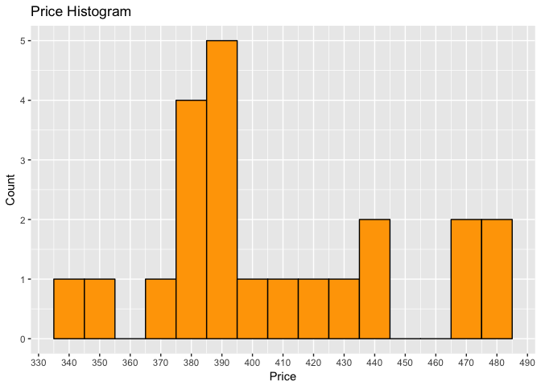
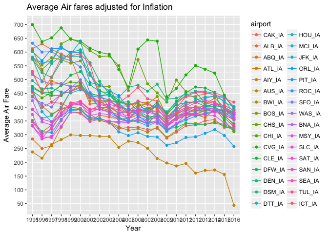
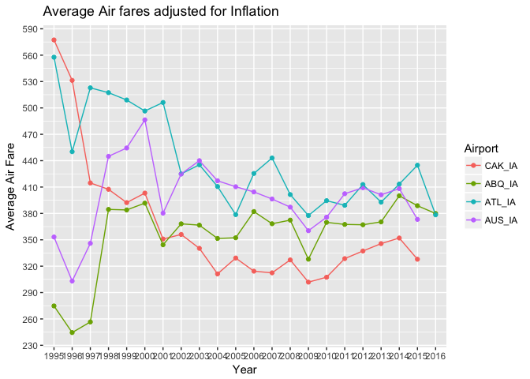

# AirFares_US


Notes: As of now the data frame requires some manipulation so that ggplot2 understands what to plot. I will first remove all the NA rows and remove the "Year", "qtr", "Average", "Average_IA" colums appearing multiple times.
*_IA means that the prices have been adjusted for inflation.


```r
df <- na.omit(df)
cols <- c("Year", "qtr")
temp <- df[, cols]
df.IA <- df[, grep("+IA", colnames(df))]
df.IA <- df.IA[, -grep("Average+", colnames(df.IA))]
df.IA <- cbind(temp, df.IA)
```
Notes: Only keeping the inflation adjusted prices. Now I have the data that I need.


```r
df.IA.melted <- melt(df.IA, id.vars = c("Year", "qtr"))
df.IA.melted$qtr <- as.factor(df.IA.melted$qtr)
df.IA.melted$Year <- as.factor(df.IA.melted$Year)
colnames(df.IA.melted) <- c("year", "qtr", "airport", "price")
```
Notes: Manipulating the data frame in a format that ggplot2 understands. So now I have data for 33 US airports. It is not a lot but still enough to work on.


```r
df.IA.melted %>% group_by(year) %>% 
  summarise(avg = mean(price)) %>% 
  ggplot(aes(x = avg)) +
  geom_histogram(binwidth = 10, color = "black", fill = "orange") +
  scale_x_continuous(breaks = seq(330, 550, 10)) + 
  scale_y_continuous(breaks = seq(0, 10, 1)) +
  xlab("Price") + ylab("Count") + ggtitle("Price Histogram")
```

<!-- -->
Notes: Most airports fares are in the 350 to 400 range. Since the number of airports is very low the results from this histogram might not be conclusive.


```r
df.IA.melted %>% group_by(year, airport) %>% 
  summarise(avg = mean(price)) %>% 
  ggplot(aes(x = year, y = avg, color = airport, group = airport)) +
  geom_point() + geom_line() +
  scale_y_continuous(breaks = seq(50, 700, 50)) +
  xlab("Year") + ylab("Average Air Fare") +
  ggtitle("Average Air fares adjusted for Inflation")
```

<!-- -->
Notes: Probably I should use less number of airports fro this graph. I'll take the ones with the lowest and the highest prices. Even if the plot is hard to read there is one thing clear from this which is the average air fares was in the 350 to 450 range.


```r
sel.airports <- c("ABQ_IA", "ATL_IA", "AUS_IA", "CAK_IA")
subset(df.IA.melted, df.IA.melted$airport == sel.airports) %>% group_by(year, airport) %>% 
  summarise(avg = mean(price)) %>% 
  ggplot(aes(x = year, y = avg, color = airport, group = airport)) + 
  geom_point() + geom_line() +
  scale_y_continuous(breaks = seq(200, 600, 30)) + 
  xlab("Year") + ylab("Average Air Fare") + ggtitle("Average Air fares adjusted for Inflation") +
  labs(color = "Airport")
```

<!-- -->
Notes: Let me pick the following airports: ABQ, ATL, AUS, CAK. Amongst these airports Akron has seen the highest drop in air fares whereas Austin ari fares increased in 2016 as compared to 1995. We can ido a similar analysis by selecting a subset of other airports too.


