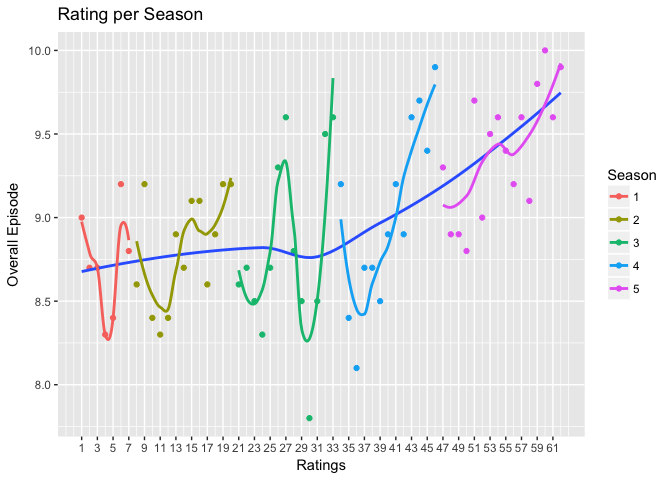
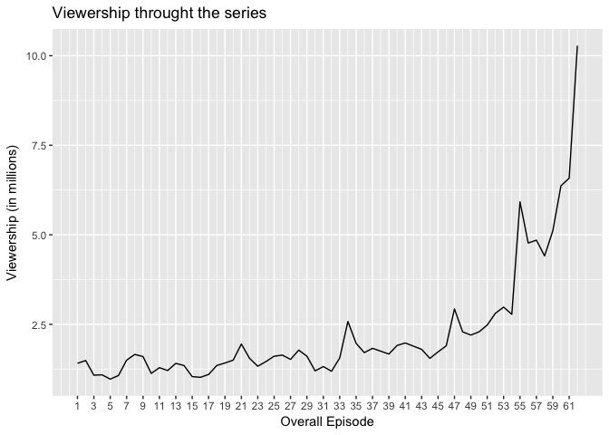
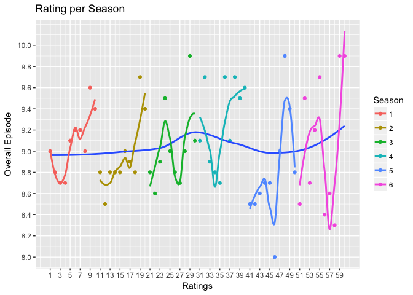
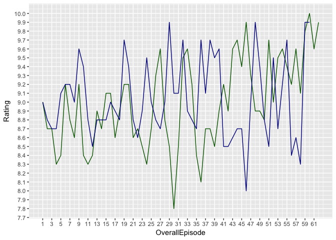
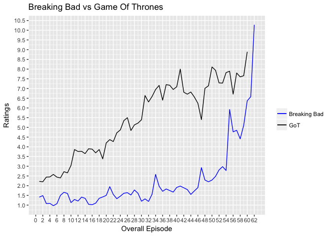

# BBvGoT


Notes: Mention the overall episode number of the whole series.


```r
ggplot(aes(x = OverallEpisode, y = Rating), data = bb) + 
  geom_point(aes(colour = Season)) + geom_smooth(method = "loess", se = F) +
  geom_smooth(aes(colour = Season), method = "loess", se = F) +
  scale_x_continuous(breaks = seq(1, 62, 2)) +
  xlab("Ratings") + ylab("Overall Episode") + ggtitle("Rating per Season")
```

<!-- -->
Notes: We plot the ratings of Breaking Bad for every episode and colour it by Season. We can use the smoothing method as lm but that will give a straight line so instead to see a general trend we use loess as the smoothing method. Eventhough the number of episodes for season 1 were only 7 while the other seasons had 13 (season 5 had 16) we still see that ratings of the episodes towards the end of the season are higher than ratings of the earlier episodes in a season. Except for the 3rd season rating of second episode of every season is less than the first episode of that season.


```r
ggplot(aes(x = OverallEpisode, y = Viewership), data = bb) +
  geom_line() + 
  scale_x_continuous(breaks = seq(1, 62, 2)) +
  labs(x = "Overall Episode", y = "Viewership (in millions)")+ 
  ggtitle("Viewership throught the series")
```

<!-- -->
Notes: To see the viewership we can use the stat_smooth() function but since the corresponding geom_line() plot is not extremely spiky we will use geom_line(). We see that the show gained high viewership towards the end and season 4 and season 5 had an all time high audience.


```r
img <- readJPEG("BB.jpg")
g <- rasterGrob(img)

ggplot(aes(x = OverallEpisode, y = Viewership), data = bb) +
  geom_line() +
  annotation_custom(g, xmin = 1, xmax = 27, ymin = 4, ymax = 10) +
  scale_x_continuous(breaks = seq(1, 62, 2)) +
  scale_y_continuous(breaks = seq(1, 10, 1)) +
  labs(x = "Overall Episode", y = "Viewership (in millions)") + 
  ggtitle("Viewership through the series")
```

<!-- -->
Notes: Although the plot is very spiky it still gives a better sense of Ratings vs Viewership as compared to the smoothig line that is introduced by the stat_smooth() function. We cannot necessarily draw any conclusion from the plot about whether the Ratings influence the Viewership or the other way round.


```r
ggplot(aes(x = OverallEpisode, y = Rating), data = GoT) + 
  geom_point(aes(colour = Season)) +
  geom_smooth(method = "loess", se = F) + geom_smooth(aes(colour = Season), method = "loess", se = F) +
  scale_x_continuous(breaks = seq(1, 60, 2)) + 
  scale_y_continuous(breaks = seq(1, 10, .2)) +
  xlab("Ratings") + ylab("Overall Episode") + ggtitle("Rating per Season")
```

<!-- -->
Notes: Plotting similar curves for Game of Thrones. We see that the ratings drop during mid season and then pick up again towards the end of the season.


```r
ggplot() +
  geom_line(aes(x = OverallEpisode, y = Rating), colour = "darkgreen", data = bb) +
  geom_line(aes(x = OverallEpisode, y = Rating), colour = "darkblue", data = GoT) +
  scale_x_continuous(breaks = seq(1, 62, 2)) + 
  scale_y_continuous(breaks = seq(7.5, 10, .1)) 
```

<!-- -->
Notes: Although we have plotted the Ratings of both the shows on the same plot but the plot looks awful to the eye. Lets see if we can improve on this.


```r
ggplot() + 
  geom_point(aes(x = OverallEpisode, y = Rating), colour = "blue", shape = 1, size = 2, data = bb) +
  stat_smooth(aes(x = OverallEpisode, y = Rating, colour = "bb"), data = bb, method = "lm", 
              formula = y ~ poly(x, 9), se = F) +
  geom_point(aes(x = OverallEpisode, y = Rating), colour = "black", shape = 2, size = 2, data = GoT) +
  stat_smooth(aes(x = OverallEpisode, y = Rating, colour = "got"), data = GoT, method = "lm", 
              formula = y ~ poly(x, 9), se = F) +
  scale_x_continuous(breaks = seq(1, 62, 2)) +
  scale_y_continuous(breaks = seq(7.5, 10, .2)) + 
  scale_colour_manual(guide = 'legend', name = "", values =c('got'='black', 'bb'='blue'), 
                      labels = c('GoT','Breaking Bad')) +
  xlab("Overall Episode") + ylab("Ratings") + ggtitle("Breaking Bad vs Game Of Thrones")
```

<!-- -->
Notes: Now we compare the 2 shows in terms of their Ratings. The plot suggests that GoT over took Breaking bad in season 4 and 5, the penultimate episode of Breaking bad was rated higher than GoT.


```r
ggplot() + 
  geom_line(aes(x = OverallEpisode, y = Viewership, colour = "bb"), data = bb) + 
  geom_line(aes(x = OverallEpisode, y = Viewership, colour = "got"), data = GoT) +
  scale_colour_manual(guide = 'legend', name = "", values = c("bb" = "blue", "got" = "black"), 
                      labels = c("Breaking Bad", "GoT")) +
  scale_x_continuous(breaks = seq(0, 62, 2)) + 
  scale_y_continuous(breaks = seq(0, 10.5, .5)) +
  xlab("Overall Episode") + ylab("Ratings") + ggtitle("Breaking Bad vs Game Of Thrones")
```

<!-- -->
Notes: Well we now know which is the most popular show among these 2. But the last 3 episodes of Breaking bad still had higher viewership as compared to Game of Thrones.


