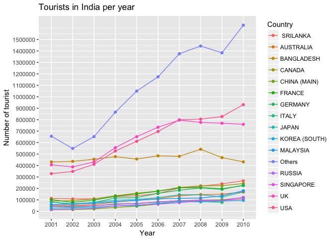
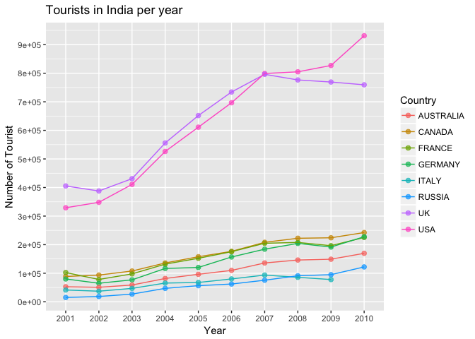
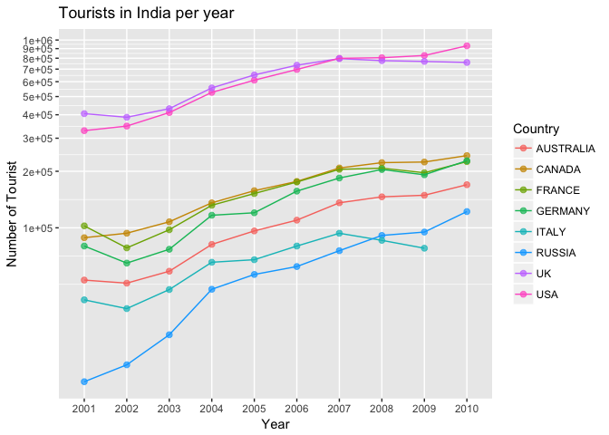
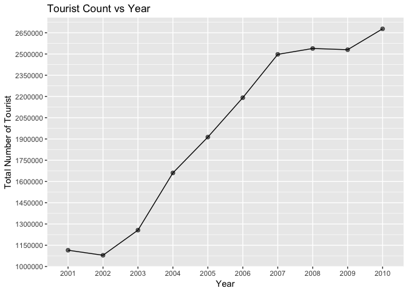

# ForeignTouristInIndia


```r
ft.long <- gather(ft, "year", "number", 2:11)
ft.long$year <- as.factor(ft.long$year)
ft.long %>% filter(!is.na(ft.long$number)) %>% 
  group_by(year) %>% 
  ggplot(aes(x = year, y = number, color = Country, group = Country)) + 
  geom_point() + geom_line() +
  scale_y_continuous(breaks = seq(0, 1500000, 100000)) +
  xlab("Year") + ylab("Number of tourist") + ggtitle("Tourists in India per year")
```

<!-- -->
Notes: Well what an awful plot this is. Probably too many line stacked over each other. Next I will plot only Non Asian countries.


```r
ft.subset <- ft[c(1,2,5,6,7,9,13,14), ]
ft.subset.long <- gather(ft.subset, "year", "number", 2:11)
ft.subset.long$year <- as.factor(ft.subset.long$year)
ft.subset.long %>% filter(!is.na(ft.subset.long$number)) %>% 
  group_by(year) %>% 
  ggplot(aes(x = year, y = number, color = Country, group = Country)) +
  geom_point(alpha = .7, size = 2) + geom_line() +
  scale_y_continuous(breaks = seq(0, 1000000, 100000)) +
  xlab("Year") + ylab("Number of Tourist") + ggtitle("Tourists in India per year")
```

<!-- -->
Notes: Well this plot looks a bit better a not quite there yet. The lines at the bottom are too close to each other. Lets try a log scale plot


```r
ft.subset.long %>% filter(!is.na(ft.subset.long$number)) %>% 
  group_by(year) %>% 
  ggplot(aes(x = year, y = number, color = Country, group = Country)) +
  geom_point(alpha = .7, size = 2) + geom_line() +
  scale_y_log10(breaks = seq(0, 1000000, 100000)) +
  xlab("Year") + ylab("Number of Tourist") + ggtitle("Tourists in India per year")
```

<!-- -->
Notes: This plot is much better. Now the plot shows that most of teh tourists are from USA and UK. These are the 2 countries that see high immigration numbers from India. So once Indian migrate to USA or UK and when become citizens they still visit family back in India. So it will be interesting to see how many tourists are 1st generation Indian-Americans.


```r
ft.subset.long$year <- as.factor(ft.subset.long$year)
ft.subset.long %>% filter(!is.na(ft.subset.long$number)) %>% 
  group_by(year) %>% 
  summarise(totalNumber = sum(number)) %>% 
  ggplot(aes(x = year, y = totalNumber, group = 1)) +
  geom_point(size = 2, alpha = .6) + geom_line() +
  scale_y_continuous(breaks = seq(1000000, 2800000, 150000)) +
  xlab("Year") + ylab("Total Number of Tourist") + ggtitle("Tourist Count vs Year")
```

<!-- -->
Notes: The number decreased marginally by 8613 in 2009, possibly because of the Mumbai Terror Attacks.


