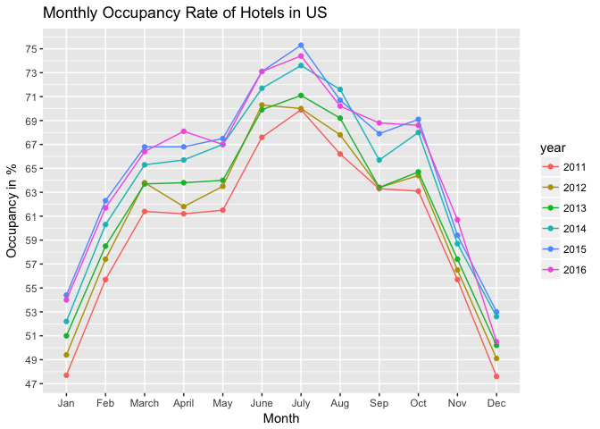

# Untitled


```r
mor.new <- mor
mor.new[12,7] <- mean(mor.new$`2016`, na.rm = T)
mor.new$month <- as.character(mor.new$month)
mor.new$month <- factor(mor.new$month, levels = unique(mor.new$month))

mor.new %>% gather("year", "number", 2:7) %>% 
  ggplot(aes(x = month, y = number, color = year, group = year)) + 
  geom_point(size = 2, alpha = .7) + geom_line(lwd = 1) + 
  scale_y_continuous(breaks = seq(0, 80, 2)) + 
  xlab("Month") + ylab("Occupancy in %") + ggtitle("Monthly Occupancy Rate of Hotels in US")
```

<!-- -->

Notes: For the year 2016 December had a missing value, so this was imputed with the mean value for that year i.e. 2016. This has produced a rather odd trend for 2016 as compared to other years. Probably a btter value should be the mean of December from all the previous year will be a better value.

```r
mor.new[12, 7] <- mean(as.numeric(mor[12, (2:6)]), na.rm = T)
mor.new$month <- as.character(mor.new$month)
mor.new$month <- factor(mor.new$month, levels = unique(mor.new$month))

mor.new %>% gather("year", "number", 2:7) %>% 
  ggplot(aes(x = month, y = number, color = year, group = year)) +
  geom_point() + geom_line() +
  scale_y_continuous(breaks = seq(45, 75, 2)) + 
  xlab("Month") + ylab("Occupancy in %") + ggtitle("Monthly Occupancy Rate of Hotels in US")
```

<!-- -->


```r
mor.new.qtr <- gather(mor.new, "year", "number", 2:7)
qtr <- rep(c("Q1", "Q2", "Q3", "Q4"), times = 6, each = 3)
mor.new.qtr <- cbind(mor.new.qtr, qtr)
mor.new.qtr$qtr <- paste(mor.new.qtr$year, mor.new.qtr$qtr)

mor.new.qtr %>% group_by(year, qtr) %>% 
  summarise(totalNumber = mean(number)) %>% 
ggplot(aes(x = qtr, y = totalNumber, color = year, group = 1)) +
  geom_point(size = 2, alpha = .7) + geom_line(lwd = 1, alpha = .7) +
  stat_smooth(method = "loess", se = F) +
  scale_x_discrete(breaks = mor.new.qtr$qtr, labels = qtr) +
  scale_y_continuous(breaks = seq(50, 75, 1)) +
  xlab("Quarter") + ylab("Percentage Occupancy") + ggtitle("Average Quarterly Occupancy Rate") +
  labs(color = "Year")
```

<!-- -->
Notes: There is seasonality in the plot with Q2 and Q3 having the higher occupancy rates as compared to Q1 andQ4. There is also an upward trend from 2011 to 2016. This means that in 2016 there were more occupied rooms in US than in 2011.


```r
mor.new %>% gather("year", "number", 2:7) %>% 
  group_by(year) %>% 
  summarise(totalNumber = mean(number)) %>% 
  ggplot(aes(x = year, y = totalNumber, group = 1)) +
  geom_point() + geom_line() + 
  scale_y_continuous(breaks = seq(60, 66, .5)) +
  xlab("Year") + ylab("Percentage Occupancy") + ggtitle("Average Yearly Occupancy Rate")
```

<!-- -->
Notes: There is a margianl drop in Mean Occupancy for 2016.


